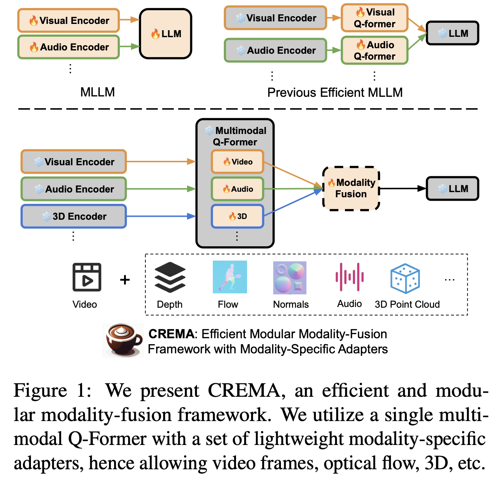
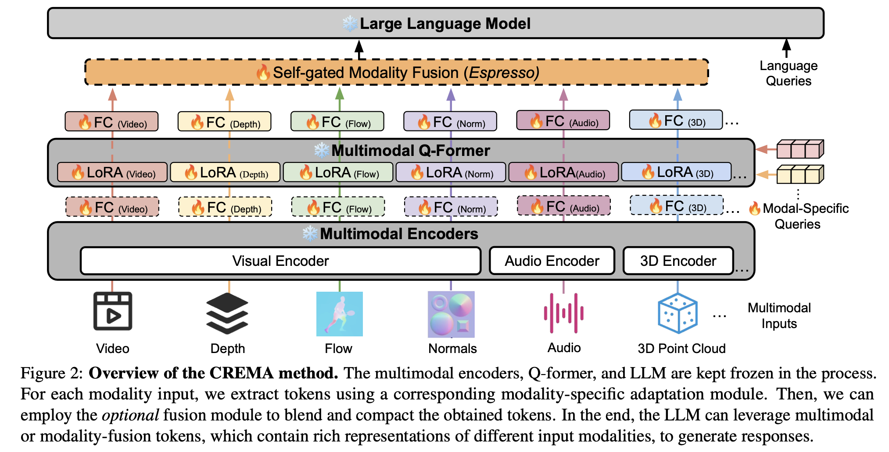

#  CREMA: Multimodal Compositional Video Reasoning via Efficient Modular Adaptation and Fusion

* Authors: [Shoubin Yu*](https://yui010206.github.io/), [Jaehong Yoon*](https://jaehong31.github.io/), [Mohit Bansal](https://www.cs.unc.edu/~mbansal/)
* Paper: [arXiv]()
* Project Page: [homepage](https://crema-videollm.github.io/)
* Online Demo: Coming soon

<div align=center> 

</div>
<br>



# Code structure
```bash

# pretrained checkpoints
./crema_checkpoints

# CREMA code
./lavis/

# running scripts for CREMA training/inference
./run_scripts

```

# Setup

## Install Dependencies

1. (Optional) Creating conda environment

```bash
conda create -n crema python=3.8
conda activate crema
```

2. build from source

```bash
pip install -e .
```


## Download Models
We initialize query tokens and FC layer for each MMQA in Multimodal Q-Former form pre-trained BLIP-2 model checkpoints.
We pre-train MMQA-audio and MMQA-3D in CRMEA framework based on [AudioCaps](https://audiocaps.github.io/) and [3D-LLM](https://github.com/UMass-Foundation-Model/3D-LLM) data respectively. 
Both Multimodal Q-Former checkpoints will be released soon.


# Dataset Preparation & Feature Extraction
We test our model on:

+ [SQA3D](https://github.com/SilongYong/SQA3D): we follow 3D-LLM data [format](https://drive.google.com/drive/folders/14_-cWOMW-Hp6T5_c6YMjwDzQOgfiO2p9).

+ [MUSIC-AVQA](https://github.com/GeWu-Lab/MUSIC-AVQA): we follow the orginal MUSIC-AVQA data [format](https://github.com/GeWu-Lab/MUSIC-AVQA/tree/main/data/json_update).

+ [NExT-QA](https://github.com/doc-doc/NExT-QA): we follow SeViLA data [format](https://github.com/Yui010206/SeViLA/tree/main/sevila_data).

We extract various extra modalities from raw video with pre-train models, please refer to each model repo and paper appendix for more details. And we will share extracted features soon. 

+ [Depth map](https://github.com/isl-org/ZoeDepth)

+ [Optical flow](https://github.com/autonomousvision/unimatch)

+ [Surface normals](https://github.com/baegwangbin/surface_normal_uncertainty)


# Training and Inference
We provide CREMA training and inference script examples as follows.

## 1) Training

```bash
sh run_scripts/crema/finetune/sqa3d.sh
```

## 2) Inference

```bash
sh run_scripts/crema/inference/sqa3d.sh
```


# Acknowledgments
We thank the developers of [LAVIS](https://github.com/salesforce/LAVIS), [BLIP-2](https://github.com/salesforce/LAVIS/tree/main/projects/blip2), [CLIP](https://github.com/openai/CLIP), [X-InstructBLIP](https://github.com/salesforce/LAVIS/tree/main/projects/xinstructblip), for their public code release.


# Reference
Please cite our paper if you use our models in your works:


```bibtex
@article{yu2024crema,
  author    = {Shoubin Yu, Jaehong Yoon and Mohit Bansal},
  title     = {CREMA: Multimodal Compositional Video Reasoning via Efficient Modular Adaptation and Fusion},
  journal   = {arxiv},
  year      = {2024},
  }
